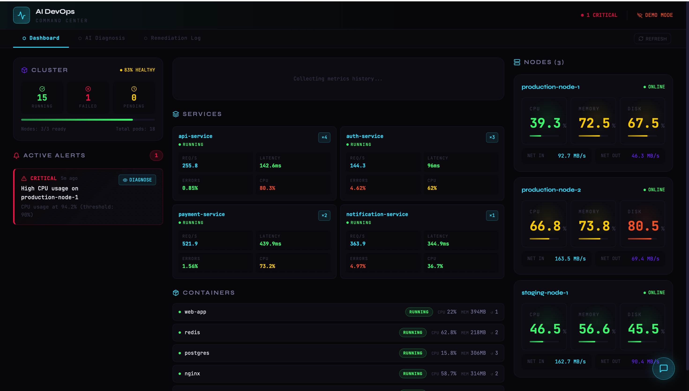
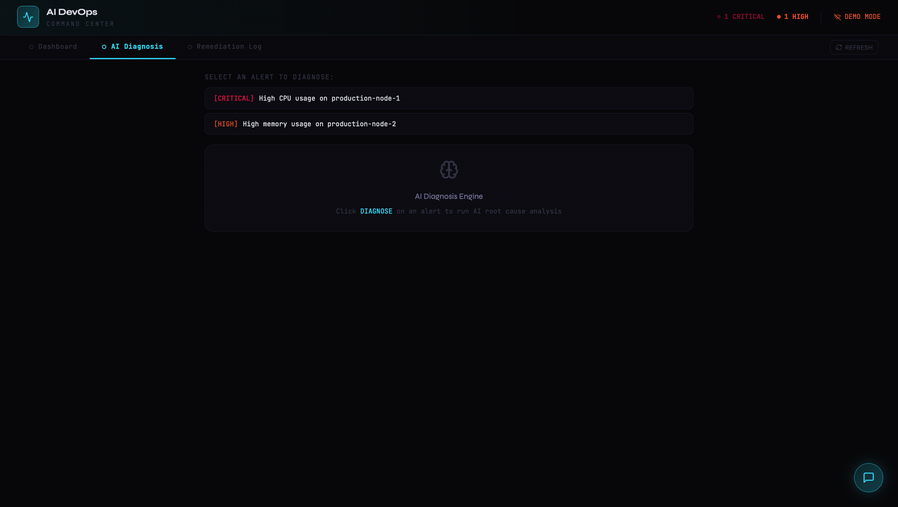
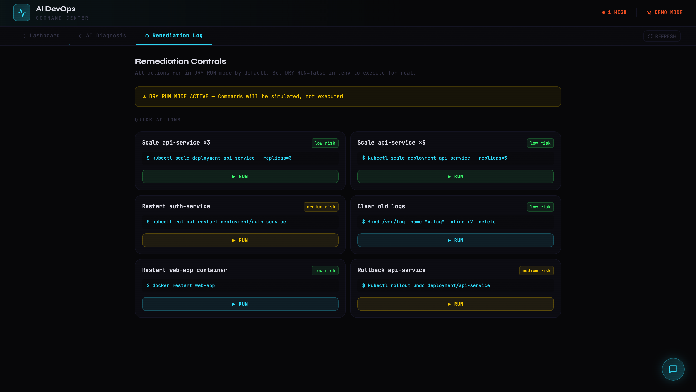

## 🖥 Live Dashboard Screenshots





# 🤖 AI DevOps Automation System

> AI-powered infrastructure monitoring, root cause analysis, and auto-remediation

---

## Architecture

```
┌──────────────────┐
│ Monitoring Agent │  — Collects metrics from Prometheus / Docker / K8s
└────────┬─────────┘
         │
         ▼
┌──────────────────┐
│ Diagnosis Agent  │  — AI (LLaMA3 / GPT-4 / Claude) finds root cause
└────────┬─────────┘
         │
         ▼
┌──────────────────┐
│ Remediation Agent│  — Generates + executes fix plans
└────────┬─────────┘
         │
         ▼
  Infrastructure
 (Docker / K8s / AWS)
```

## Quick Start

### 1. Clone & Configure
```bash
cp .env.example .env
# Edit .env with your LLM API keys and infrastructure details
```

### 2. Docker Compose (Recommended)
```bash
cd infra/docker
docker-compose up -d

# Pull Ollama model (for local LLM)
docker exec -it ai-devops-ollama ollama pull llama3
```

### 3. Manual Setup
```bash
# Install Python deps
pip install -r requirements.txt

# Start backend
uvicorn backend.api.main:app --host 0.0.0.0 --port 8000 --reload

# Start frontend (new terminal)
cd frontend/dashboard
npm install && npm run dev
```

## Access Points

| Service       | URL                          |
|---------------|------------------------------|
| Dashboard     | http://localhost:5173         |
| API Docs      | http://localhost:8000/docs    |
| Grafana       | http://localhost:3001         |
| Prometheus    | http://localhost:9090         |
| Kibana        | http://localhost:5601         |

## API Endpoints

```
GET  /api/metrics/current       — Latest metrics snapshot
GET  /api/metrics/history       — Historical metrics
GET  /api/alerts/active         — Active alerts
POST /api/alerts/action         — Acknowledge/resolve alerts
POST /api/diagnosis/analyze     — AI root cause analysis
GET  /api/diagnosis/demo        — Demo RCA
POST /api/remediation/plan      — Generate remediation plan
POST /api/remediation/execute   — Execute remediation
POST /api/chat/message          — DevOps chatbot
```

## LLM Configuration

Set `LLM_PROVIDER` in `.env`:

| Provider    | Value        | Notes                          |
|-------------|--------------|--------------------------------|
| Ollama      | `ollama`     | Local, free, private           |
| OpenAI      | `openai`     | GPT-4o — needs API key         |
| Anthropic   | `anthropic`  | Claude — needs API key         |

## Kubernetes Deployment

```bash
kubectl apply -f infra/kubernetes/namespace.yaml
kubectl apply -f infra/kubernetes/configmap.yaml
kubectl apply -f infra/kubernetes/secret.yaml
kubectl apply -f infra/kubernetes/deployment.yaml
kubectl apply -f infra/kubernetes/service.yaml
kubectl apply -f infra/kubernetes/hpa.yaml
kubectl apply -f infra/kubernetes/ingress.yaml
```

## Features

- **Real-time monitoring** — CPU, memory, disk, network, pods, containers
- **AI diagnosis** — LLM-powered root cause analysis with evidence
- **Auto-remediation** — Scale, restart, rollback, clear logs
- **Predictive alerts** — ML trend analysis to predict future failures
- **Incident chatbot** — Ask AI about any infrastructure issue
- **Self-healing** — Automatic fix execution (dry-run by default)
- **Multi-provider LLM** — Ollama (local) / OpenAI / Anthropic

## Tech Stack

| Layer       | Technology                              |
|-------------|------------------------------------------|
| Backend     | Python, FastAPI, asyncio                 |
| AI Layer    | LangChain, Ollama/Llama3, OpenAI, Anthropic |
| Frontend    | React 18, Recharts, Vite                 |
| Monitoring  | Prometheus, Grafana                      |
| Infra       | Docker, Kubernetes, HPA                  |
| Logs        | ELK Stack (Elasticsearch + Kibana)       |
| Database    | PostgreSQL, Redis                        |

## Safety

- **DRY_RUN=true** by default — all remediation is simulated
- High-risk actions require manual approval
- Full execution log for audit trail
- Rollback commands included in every plan
